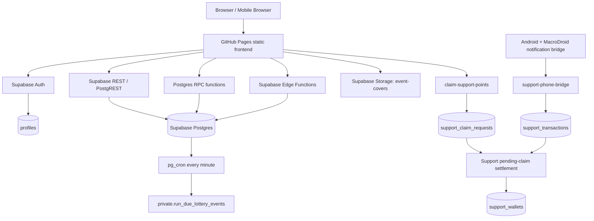
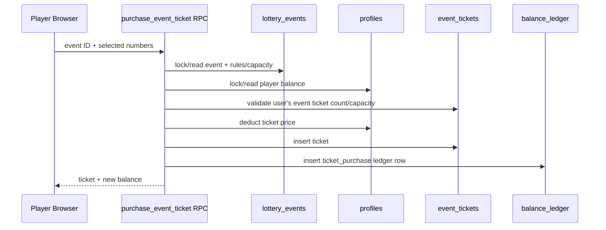
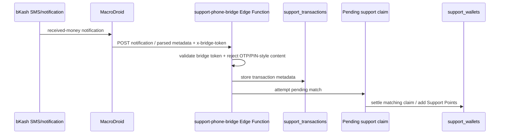

# DRAW//01 Architecture

> Source of truth for the current production architecture as of 2026-10-07.
>
> Repository: `umar-vai/Lottery-`  
> Public app: `https://umar-vai.github.io/Lottery-/`  
> Supabase project: `Lottery DRAW01` (`mwtlsnneooxmryondrex`, Mumbai / `ap-south-1`)

## 1. What the system is

DRAW//01 is a static-browser frontend backed by Supabase. The current product is a **multi-event virtual-credit draw simulation platform**. It also contains an independent **Development Support Points** system.

The two balances are intentionally separate:

- **Draw Credits** live in `profiles.balance` and are used by the event-ticket simulation.
- **Support Points** live in `support_wallets.balance` and are development-support records only. They must never be accepted by ticket-purchase logic, converted into Draw Credits, used for odds/prizes, or treated as cash.

The repository still contains an older Powerball-style engine. That is legacy code/data and is not the primary public event architecture anymore.

---

## 2. High-level topology



There is no traditional application server in the repository. Security-sensitive operations are expected to be enforced in PostgreSQL/RPC/Edge Functions, not trusted to browser JavaScript.

---

## 3. Deployment architecture

### Frontend

The frontend is plain HTML/CSS/JavaScript hosted by **GitHub Pages**.

Pushes to `main` trigger:

`.github/workflows/pages.yml`

The workflow:

1. checks out the repo,
2. configures Pages,
3. uploads the whole repository as the static site,
4. deploys it with `actions/deploy-pages`.

There is no frontend build step, bundler, React runtime, Next.js server, or Node backend in production.

### Supabase

Production backend services are:

- Supabase Auth + Google OAuth
- PostgreSQL
- PostgREST
- RPC functions
- Row Level Security
- Edge Functions
- Storage
- `pg_cron`

### Public configuration

`config.js` contains only public browser configuration:

- Supabase project URL
- Supabase publishable key
- GitHub Pages app URL

A publishable key is expected in browser code. **Never commit or expose the Supabase service-role key, Google Client Secret, bridge raw secret tokens, or any private backend credential.**

---

## 4. Frontend entry points

### `index.html`

Current public homepage.

Main responsibilities:

- active/upcoming/completed event discovery
- winner ticker
- global user shell
- current Draw Credit display
- Support Points display/entry point

Important loaded modules include:

- `site-shell.js`
- `support-live.js`
- `home-v2.js`
- homepage CSS layers

### `event.html` + `event.js`

Current public event detail / ticket page.

`event.js` uses Supabase JS v2 and performs:

- event lookup by `?e=<slug>`
- Google OAuth login
- current profile loading
- event rules rendering
- number picker and Quick Pick
- own-ticket history
- ticket purchase via `purchase_event_ticket(...)`
- result rendering
- periodic event refresh

Ticket purchase must remain server-authoritative. The frontend calls:

```text
purchase_event_ticket(p_event_id, p_white_numbers, p_bonus_ball)
```

The RPC is responsible for atomic validation, capacity checks, balance deduction and ticket creation.

### `ops-v4.html` + `ops-v4.js`

Current admin entry point.

Do not treat `admin.html`, `ops-v2.html`, or older admin files as the current entry point.

Admin areas:

- Overview
- Events & Tickets
- Winners (injected/enhanced by `admin-v5.js`)
- Players
- Ledger
- Audit

`ops-v4.js` is the base admin implementation. Additional behavior is layered through enhancement scripts rather than a single compiled application.

### Admin enhancement files

- `admin-v5.js` / `admin-v5.css`
  - event workspace
  - winners UI
  - completed-event safe metadata edit
  - relaunch completed event as fresh draft
  - winner/player credit editing hooks

- `admin-v6.js` / `admin-v6.css`
  - player search
  - winner-event accordion behavior

- `event-cover-admin.js` / `event-cover-admin.css`
  - event cover upload and association

- `credit-admin.js` / `credit-admin.css`
  - virtual credit request review

- `support-wallet-admin.js` / `support-wallet-admin.css`
  - Support Points wallet/admin adjustment UI

- `support-admin.js` / `support-admin.css`
  - Support Bridge administration, loaded dynamically by `site-shell.js` on `ops-v4.html`

### `site-shell.js`

Shared site shell injected across pages.

Responsibilities:

- global navbar/footer replacement
- browser session discovery
- profile lookup
- Draw Credit pill
- admin-nav visibility
- login/logout
- loading shared support/credit/admin assets
- compatibility with older DOM IDs

Important caveat: session discovery in several legacy scripts manually parses Supabase localStorage rather than consistently using one shared Supabase client. A future refactor should centralize auth/session handling.

---

## 5. Current event system

The primary event model is based on these tables:

```text
profiles
    |
    +---- event_tickets ---- lottery_events ---- event_prize_tiers
    |          |
    |          +---- balance_ledger
    |
    +---- balance_ledger
```

### Event lifecycle

Typical lifecycle:

```text
DRAFT
  -> PUBLISHED
      -> OPEN / UPCOMING / LOCKED (derived from schedule)
          -> COMPLETED

or

DRAFT / PUBLISHED -> CANCELLED
```

`lottery_events.status` stores the durable state. UI labels such as `OPEN`, `UPCOMING`, `LOCKED`, and `AWAITING DRAW` are derived from `status`, `schedule_mode`, `opens_at`, `cutoff_at`, and `draw_at`.

### Schedule modes

`scheduled`

- `opens_at`
- `cutoff_at`
- `draw_at`
- automatic event processing can run through `pg_cron`

`manual`

- remains open according to admin/event state
- admin triggers the draw

### Number rules

Each event carries its own rules:

- `white_ball_count`
- `white_ball_max`
- `bonus_ball_enabled`
- `bonus_ball_max`

The system is not hardcoded to one 5/69 + 1/26 event format.

### Capacity

Per event:

- `max_tickets_per_user` — required
- `max_players` — nullable = unlimited
- `max_total_tickets` — nullable = unlimited

These limits should be enforced in `purchase_event_ticket`, not only in the UI.

### Ranked winners

`event_prize_tiers` stores one prize amount per rank.

Example:

```text
rank 1 -> 500 credits
rank 2 -> 350 credits
rank 3 -> 250 credits
```

`winner_count` on the event should correspond to the configured rank count.

The draw engine selects **existing ticket IDs from that event's own ticket pool**. It must not fabricate tickets and must not select tickets from another event.

Winner information is written back to `event_tickets`:

- `is_winner`
- `winner_rank`
- `prize_awarded`

Event summary fields also include:

- `winner_summary`
- `winning_ticket_count`
- `completed_at`
- commitment/reveal fields

### Automatic event scheduler

Production currently has one active cron job:

```text
lottery-events-every-minute
schedule: * * * * *
command: select private.run_due_lottery_events();
```

This is the current scheduled-event automation. Do not assume the old Powerball cron described in the original README is still the live scheduler.

---

## 6. Draw Credit system

### Source of truth

`profiles.balance`

### Ledger

Every important balance movement should be recorded in `balance_ledger`.

Current ledger categories are designed around:

- admin adjustment
- ticket purchase
- prize credit

The browser must not directly update `profiles.balance` for a purchase. Use an RPC that locks/validates the relevant state and writes the ledger atomically.

### Ticket purchase flow



Admin balance changes use `admin_set_user_balance(...)` and should preserve ledger/auditability.

---

## 7. Virtual Credit Request system

This is separate from Support Points.

Tables/functions:

- `credit_requests`
- `private.review_credit_request(...)`
- `public.admin_review_credit_request(...)`

Frontend:

- `credit-center.js/css`
- `credit-admin.js/css`

Users can request virtual test credits; admins approve/reject. Approved requests create a Draw Credit balance adjustment. This is an internal virtual-credit workflow, not a payment gateway.

---

## 8. Development Support Points architecture

Support Points are an independent accounting namespace.

### User-facing balance

`support_wallets.balance`

### Primary frontend

- `support-center.js/css`
- `support-live.js/css`
- admin extensions under `support-*.js/css`

The UI explicitly states Support Points are separate from Draw Credits.

### Phone bridge flow

Current phone-side proof-of-concept uses Android + MacroDroid notification access.

Conceptual flow:



`support-phone-bridge` has `verify_jwt=false` because the device authenticates with its own bridge token. The token is SHA-256 hashed before comparison with `support_bridge_devices.token_hash`.

The function can accept either:

- structured Android transaction metadata, or
- a raw received-money notification/SMS string for parsing.

It rejects text that looks like OTP/PIN/password/verification authentication content.

Stored transaction data includes metadata such as:

- provider
- sender hash
- sender last 4 digits
- amount
- TrxID
- received timestamp
- fingerprint

### User claim flow

`claim-support-points` requires a signed-in user JWT.

The user submits:

- sender number
- TrxID
- terms acknowledgement

The Edge Function normalizes and hashes the sender number and calls `service_submit_support_claim(...)`.

If a matching verified transaction already exists, settlement can complete immediately. Otherwise a pending claim is created and can settle later when the phone bridge receives the transaction.

### Hard separation rule

Do not modify ticket purchasing to read `support_wallets.balance`.

Do not add a Support Points -> Draw Credits conversion RPC.

Do not place Support Points in `balance_ledger` as if they were Draw Credits.

---

## 9. Authentication and authorization

### Authentication

Google OAuth through Supabase Auth.

Production redirect base:

```text
https://umar-vai.github.io/Lottery-/
```

### Profile creation

`profiles.id` maps to the Supabase Auth user UUID. `handle_new_user()` is responsible for profile bootstrap behavior.

### Roles

`profiles.role`

Current expected roles include:

- `player`
- `admin`

Admin RPCs must enforce admin authorization server-side. Hiding the Admin button in JavaScript is not a security boundary.

### `is_admin()`

Database RLS and admin RPCs rely heavily on `public.is_admin()`.

Any change to role logic must be reviewed against all RLS policies and SECURITY DEFINER functions.

---

## 10. RLS/security boundaries

Important design rule:

> The browser is untrusted. UI restrictions are convenience only; PostgreSQL/Edge Function authorization is the real boundary.

Examples of current RLS behavior:

- users can read their own profile
- admins can read all profiles
- users can read their own event tickets
- admins can read all event tickets
- public/anonymous users can read public event metadata
- draft events are admin-only
- users can read their own Draw Credit ledger
- users can read their own Support wallet/claims
- audit logs are admin-readable

Most state-changing event/admin operations are intentionally exposed through RPCs instead of direct table writes.

### SECURITY DEFINER caution

There are many SECURITY DEFINER functions. When editing one:

1. explicitly validate `auth.uid()` / admin status where required,
2. set a safe `search_path` in the function definition,
3. restrict EXECUTE grants,
4. never trust user-supplied `user_id`, amount, role, event status, or balance without authorization,
5. keep transaction-sensitive writes atomic.

---

## 11. Storage

Bucket:

```text
event-covers
```

Properties:

- public read bucket
- 5 MB file limit
- allowed MIME types:
  - `image/jpeg`
  - `image/png`
  - `image/webp`

Frontend/admin upload logic lives in `event-cover-admin.js`.

`lottery_events.cover_image_url` stores the resulting public URL.

Known technical debt: the cover uploader was added as an enhancement layer and should eventually be made transactional with event-save behavior to avoid orphaned uploads if an event create/edit is cancelled or races.

---

## 12. Production Edge Functions

Currently deployed functions include:

### Current Support Points path

- `support-phone-bridge` — current phone bridge ingest endpoint, custom bridge-token auth
- `support-device-admin` — current device administration endpoint, JWT-protected
- `claim-support-points` — user claim endpoint, JWT-protected

### Legacy/deprecated endpoints

- `phone-bridge`
- `bridge-device-admin`

These belong to an earlier bridge iteration and should not be used for new work unless explicitly audited first.

### Decommissioned demo endpoint

- `claim-demo-credit`

The demo-credit database/UI was removed. The deployed function has been replaced with a `410 Gone` decommissioned stub. It can be deleted from the Supabase Dashboard when doing infrastructure cleanup.

Edge Function source for the support system is currently not fully mirrored in this repository. This is technical debt: production function source should be checked into `supabase/functions/<function-name>/` before major backend development.

---

## 13. Legacy Powerball-style subsystem

The database/repository still contains the original simulation engine:

- `draws`
- `tickets`
- `ticket_results`
- `game_settings`
- `draw_events`
- `draw_secrets`
- `app.js`
- `supabase/schema.sql`
- `supabase/secure_draw.sql`
- `supabase/automatic_draw_scheduler.sql`
- `supabase/functions/draw-engine/`

The original `README.md` is primarily about this legacy architecture.

The current user-facing platform is the newer `lottery_events` + `event_tickets` architecture.

Phase 5 verified that the legacy engine is paused, the old draw-engine cron is not active, current HTML entry points do not load `app.js`, and the observed 24-hour production window had zero REST traffic to the legacy draw/ticket tables. Historical rows are therefore retained, but browser mutation of legacy `public.tickets` is frozen: authenticated clients can read their own historical rows but cannot INSERT/UPDATE/DELETE them.

Do not delete legacy tables/functions casually. Historical draw/ticket/result/seed rows still exist and may be useful for audit/history. Any later physical archival/removal requires a fresh dependency and retention review.

The active draw automation is the **lottery-events** scheduler, not the old Powerball draw-engine cron.

---

## 14. Known technical debt

1. **README is outdated.** It describes the original Powerball-style subsystem as if it were the whole live product.
2. **Auth/session handling is duplicated.** `site-shell.js`, `ops-v4.js`, `admin-v5.js`, support modules and Supabase JS do not all use one session abstraction.
3. **Admin is layered.** `ops-v4.js` plus V5/V6 enhancement scripts makes behavior harder to reason about than one cohesive admin module.
4. **Production Edge Function source is not fully source-controlled.** Mirror all live functions into `supabase/functions/`.
5. **Database migrations are incomplete in Git history.** The live database has evolved beyond `supabase/schema.sql`.
6. **Legacy and current event engines coexist.** This increases schema/function surface area.
7. **`event.js` HTML escaping has a minor quote entity typo** (`&quot` missing the semicolon). Fix when next touching that helper.
8. **Event-cover association can race/orphan uploads.** Integrate upload/linking more tightly with event save.
9. **Shared asset loading can duplicate scripts/styles** if a page explicitly loads an asset that `site-shell.js` also injects; guard by URL or choose one loading path.
10. **Polling is common.** Homepage/admin/support status use timed refreshes rather than a consistent Realtime subscription model.
11. **Deprecated bridge endpoints remain deployed.** Audit and delete after confirming no device uses them.

---

## 15. Recommended future architecture direction

Do not rewrite immediately. Stabilize first.

Recommended order:

1. source-control the actual production DB migrations and Edge Functions,
2. add automated smoke/integration tests for ticket purchase + draw + balances,
3. centralize auth/session/client code,
4. consolidate admin enhancement scripts,
5. mark/delete legacy files only after dependency analysis,
6. add a development/staging Supabase branch for risky migrations,
7. move frontend constants to one config module,
8. add error telemetry and structured operational logging.

The existing architecture can continue to support new features without a framework migration. A React/Next.js rewrite is optional, not required to extend the current system.

---

## 16. Files a new developer should read first

In this order:

1. `DEVELOPER-HANDOFF.md`
2. `ARCHITECTURE.md`
3. `DATABASE.md`
4. `index.html`
5. `site-shell.js`
6. `home-v2.js`
7. `event.html`
8. `event.js`
9. `ops-v4.html`
10. `ops-v4.js`
11. `admin-v5.js`
12. `admin-v6.js`
13. `support-center.js`
14. `support-wallet-admin.js`
15. `event-cover-admin.js`
16. `.github/workflows/pages.yml`
17. only then inspect the old `README.md` / legacy Powerball subsystem

For database details, use `DATABASE.md` as the map but verify production before applying migrations.
